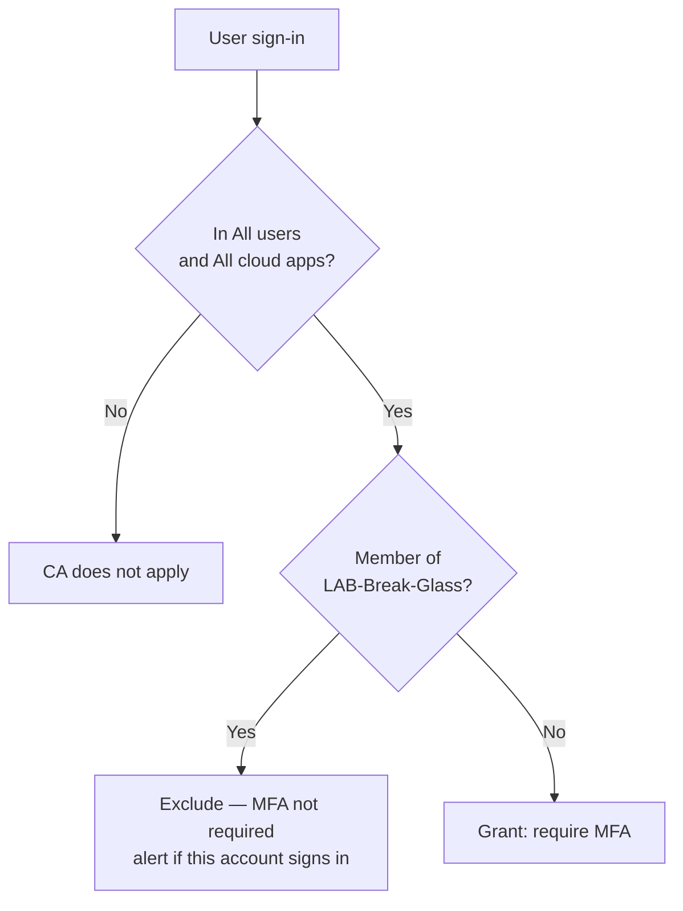

# Conditional Access baseline (Day 1)

**LAB ONLY.** Baseline for a tenant you own. Enabling CA without [break-glass](break-glass.md) is how labs become lockouts.

**AZ-104:** implement and review Conditional Access.  
**AZ-305:** design identity security controls and understand blast radius.

## Day 1 policy: MFA On for users

| Field | Lab baseline |
| --- | --- |
| Name | `LAB-CA-001 MFA On for users` |
| State | **Report-only** until break-glass is tested, then `On` |
| Users include | All users |
| Users exclude | `LAB-Break-Glass` (the two cloud-only emergency accounts) |
| Target resources | All cloud apps (Day 1). Later: exclude a break-glass-only app if you add one |
| Conditions | None extra on Day 1 (no device compliance — that is Intune / Day 2) |
| Grant | **Require multifactor authentication** |
| Session | Default |

That is the whole Day 1 control. Named locations, insider risk, authentication strength, and compliant-device grants are **not** in this pack.

## Why report-only first

Report-only shows who **would** have been blocked without blocking them. I use it to find:

- Service accounts / guest flows that are not ready for MFA
- Break-glass accidentally included
- Apps that break on interactive MFA (legacy auth — block those in a **separate** policy once you have inventory)

Flip to `On` only after: break-glass sign-in works, exclusion group is correct, and report-only looks boring.

## What I would add in production (not Day 1 evidence)

| Later policy | Intent |
| --- | --- |
| Block legacy authentication | Exchange ActiveSync / IMAP without modern auth |
| Privileged role = phishing-resistant MFA | Admins are not on SMS |
| Device compliance | After Intune exists (Day 2 — **out of scope here**) |
| Named locations | Challenge or block from outside known egress |
| Sign-in risk | Entra ID P2 / Identity Protection |

I would still keep break-glass excluded from **every** policy that can prevent a portal sign-in.

## Lab vs exam vs job

- **Exam:** you can recite “include all users, exclude emergency access, require MFA.”
- **This lab:** same design, written so a reviewer sees the exclusion is first-class, not a footnote.
- **Job:** CA is change-controlled. I would not click `On` on a Friday without a rollback owner.

## Honest limit

No tenant export and no “enabled in production” claim. Sibling lab [Azure-Cloud-Skills-and-Use-Cases / Lab 01](https://github.com/supbrice/Azure-Cloud-Skills-and-Use-Cases/tree/main/labs/01-identity-access) creates an optional CA object **disabled** in Terraform for the same reason.
