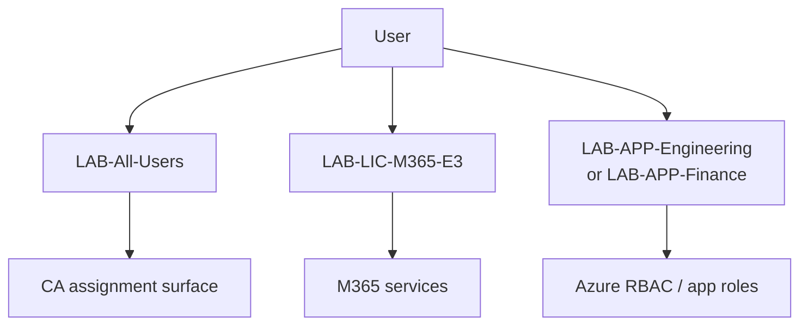

# Group-based access patterns

**LAB ONLY.** Groups are the assignment unit. Users move; groups stay.

**AZ-104:** create groups, assign Azure RBAC and M365 licenses via groups.  
**AZ-305:** design least privilege — role to group, group to user, not user-to-role sprawl.

## Three group families

Do not put licenses, app roles, and privileged directory roles in one group. A mover who changes department should not lose the ability to reset a PIM activation, and a leaver should not require hunting twenty direct assignments.

| Family | Lab name prefix | Carries | JML action |
| --- | --- | --- | --- |
| License | `LAB-LIC-*` | M365 / Entra P1/P2 SKUs (group-based licensing) | Joiner add, leaver remove |
| App / data | `LAB-APP-*` | Enterprise app roles, SharePoint / Team access, Azure RBAC at RG | Mover swap |
| Role / ops | `LAB-ROLE-*` | Azure RBAC or Entra role **eligibility** (via PIM group assignment) | Rarely moved; ticketed |

Day 1 lab set:

| Group | Purpose |
| --- | --- |
| `LAB-All-Users` | Everyone in-scope for baseline CA and “has a mailbox/license path” |
| `LAB-LIC-M365-E3` | Group-based licensing (SKU is a placeholder in config) |
| `LAB-APP-Engineering` | Engineering apps / RG Reader (or similar) |
| `LAB-APP-Finance` | Finance apps — mover target |
| `LAB-Break-Glass` | Exclusion set for CA — **never** used by JML |
| `LAB-PIM-UserAdmin-Approvers` | PIM approvers — not a license group |

## Patterns I defend in interviews

1. **Assign Azure roles to groups, not people.** Subscription Owner on a user is a finding; Contributor on `LAB-ROLE-NetOps` at one resource group is a design.
2. **Mover = group swap.** Department and job title are attributes; access is membership. See [Set-LabMover.ps1](../scripts/mover/Set-LabMover.ps1).
3. **Dynamic groups are a filter, not a dump.** `department eq 'Engineering'` is fine for `LAB-APP-Engineering`. Do not make a dynamic group the only Global Admin path.
4. **Nested groups:** convenient for “all corp users,” painful for license / PIM (not all products expand nesting the same way). Lab JML adds **direct** membership so the plan is visible.
5. **Synced vs cloud groups.** Hybrid estates often sync role groups from AD. Cloud-only groups are better for CA exclusions and break-glass. Do not sync `LAB-Break-Glass`.

## Hybrid note

In the [configure-ad](https://github.com/supbrice/configure-ad) sibling lab, on-prem `GG-Helpdesk` / `GG-ServerOperators` are the AD half. After Cloud Sync / Connect, you either:

- Sync those groups and assign cloud RBAC to the synced object, or
- Keep AD for on-prem ACL and recreate cloud access as `LAB-APP-*` / `LAB-ROLE-*`

I prefer **cloud groups for cloud access** so a leaver disable in Entra does not wait on AD replication to remove Azure Owner.

## Honest limit

Scripts resolve groups by **display name** from config. They do not create an enterprise group catalog or access packages (Entitlement Management). That is IGA, not Day 1.
