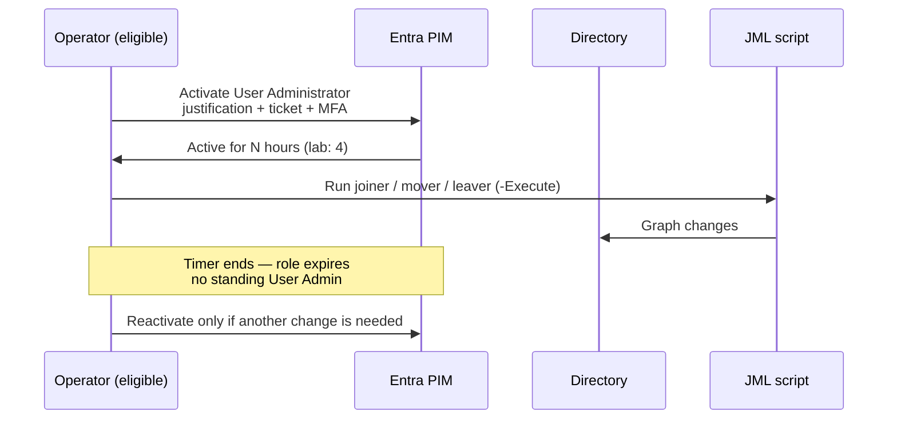

# PIM — eligible User Administrator

**LAB ONLY.** Privileged Identity Management story for Entra ID P2 (or trial) in a tenant you own.

**AZ-104:** manage Entra roles; understand standing vs time-bound access.  
**AZ-305:** design privileged access — eligible, approved, time-boxed.

## The story (activate → expire)

User Administrator can create users, reset passwords, and change group memberships — the same blast radius as a sloppy JML script. In this pack it is **eligible**, not standing.

| Setting | Lab value | Production note |
| --- | --- | --- |
| Role | User Administrator | Same; Global Admin stays on break-glass + a tiny eligible set |
| Assignment type | **Eligible** | Never standing for daily operators |
| Activation max | 4 hours | 1–8 hours is the usual band; shorter for higher roles |
| MFA on activate | Required | Required |
| Justification | Required | Require a change / ServiceNow number |
| Approver | `LAB-PIM-UserAdmin-Approvers` (optional in a tiny lab) | Required in prod for User Admin and above |
| Notification | Email to approvers | Plus SIEM on activation |
| Access review | Quarterly (prod) | Lab can skip; say so |

## How this ties to JML

The [scripts](../scripts/) use Graph permissions (`User.ReadWrite.All`, `Group.ReadWrite.All`). In a real tenant I would **not** run those as a standing Global Admin.

Two acceptable patterns:

1. **Human + PIM:** operator activates User Administrator, runs the script interactively, role expires.
2. **App + least privilege:** an automation app registration with only the Graph scopes it needs, certificate/OIDC, no user role. Still change-controlled.

This repo demonstrates pattern 1 in docs and keeps scripts usable as either an interactive admin or a future automation identity.

## What standing User Admin looks like (finding)

If `Get-MgDirectoryRoleMember` for User Administrator returns daily-use accounts, that is a hygiene finding — same idea as the audit script in the [identity lab](https://github.com/supbrice/Azure-Cloud-Skills-and-Use-Cases/blob/main/labs/01-identity-access/scripts/Audit-PrivilegedAccess.ps1). Eligible + empty standing membership is the goal.

## Tradeoffs

| Model | When it is right | Cost |
| --- | --- | --- |
| Eligible + activate | Humans doing JML in a ticket window | Activation friction; need P2 |
| App-only Graph | Scheduled / HR-driven JML | App secret/cert hygiene; over-scoped apps are worse than PIM |
| Standing User Admin | Almost never | One phished admin = directory write |

## Lab checklist (portal)

- [ ] Entra ID P2 or PIM trial on the lab tenant
- [ ] Your daily account is **eligible** User Administrator, not active 24/7
- [ ] Break-glass remains standing Global Admin (documented exception)
- [ ] You can activate, run `New-LabJoiner.ps1 -Execute` in a throwaway tenant, then watch the role expire

## Honest limit

This repo does not call PIM Graph APIs to create eligible assignments. Doing that against a cloned config would be reckless. The proof is the activate → expire design and the refusal to treat standing User Admin as the default.
